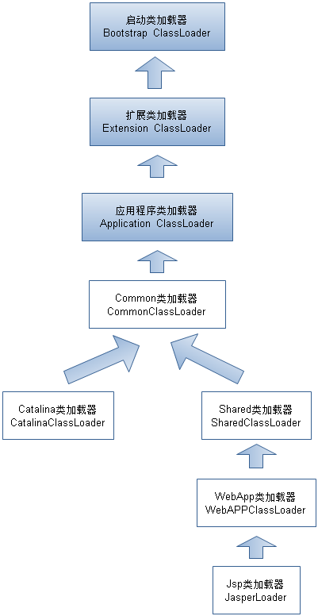

# 类加载及执行子系统的案例与实战
- 在Class文件格式与执行引擎这部分中, 用户不能直接改变. 能通过程序进行操作的主要是字节码生成与类加载器这两部分的功能.
### Tomcat : 正统的类加载器架构
1. Tomcat 需要解决的问题:
    - 部署在同一个服务器上的Web应用程序所使用的Java类库可以相互隔离
    - 部署在同一个服务器上的Web应用程序可以共享Java类库
    - 服务器应该尽可能保证自己不受部署的程序影响
    - 支持热部署
2. Tomcat 的目录结构:
    - /common: 可以被Tomcat和所有的应用程序使用
    - /server: 只能被Tomcat使用
    - /shared: 只能被应用程序使用
    - /WebApp/WEB-INF: 只能被此应用程序使用
3. Tomcat 类加载器架构:
    - 
    - CommonClassLoader 加载 /common 目录中的类库
    - CatalinaClassLoader 加载 /server 目录中的类库
    - SharedClassLoader 加载 /shared 目录中的类库
    - WebAPPClassLoader 加载 /WebApp/WEB-INF 目录中的类库
    - JasperLoader 负责加载此JSP页面所编译的class文件. 当检测到jsp文件被修改时替换掉原来的加载器,实现热部署
------
### OSGi : 灵活的类加载器架构
1. OSGi 是OSGi联盟制定的一个基于Java语言的动态模块化规范, 是"事实上"的Java世界模块化标准
2. OSGi 中的模块(Bundle) 类似于一般的Java类库, 都是以JAR格式封装
3. 每个Bundle可以声明所依赖的Java Package, 也可以声明它允许导出发布的Java Package. 
4. 在OSGi中, Bundle之间的依赖关系从传统的上下层依赖转变为平级依赖, 类库的可见性被非常精确地控制
5. OSGi的类加载查找规则:
    - 以`java.*`开头的类, 委派给父类加载
    - 否则, 委派列表名单中的类, 委派给父类加载器加载
    - 否则, Import列表中的类, 委派给Export此类的类加载器加载
    - 否则, 查找当前Bundle的Classpath, 使用自己的类加载器加载
    - 否则, 查找是否在自己的Fragment Bundle中, 若是, 委派给Fragment Bundle的类加载器加载
    - 否则, 查找Dynamic Import列表的Bundle, 委派给对应的Bundle类加载器加载
    - 否则, 类查找失败
6. OSGi加载器的关系不再是双亲委派模型的树形结构, 而是一种更为复杂的/运行时才能确定的网状结构, 带来了更好的灵活性
7. 引入了额外的复杂度, 带来了线程死锁和内存泄漏的风险f