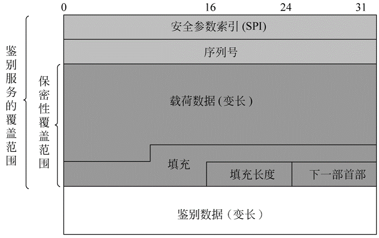
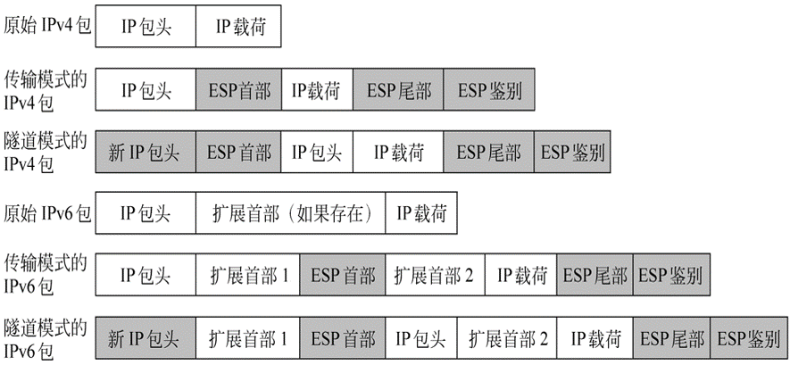

# 网络安全

## 第六章
1. 术语
    - SSL: 安全套接字层
    - HTTP: 超文本传输协议
    - FTP: 文件传输协议
    - SMTP: 简单邮件传输协议
    - HTTPS: HTTP+ SSL/TLS
    - SSH: 网络安全通信协议
2. 协议层级

    |HTTP/FTP/SMTP|
    |:--:|
    |SSL|
    |TCP|
    |IP|

3. SSL
    - 使用TCP提供一种`可靠的端对端`的安全服务, 由两层协议组成
        - `SSL记录协议`对各种高层协议提供基本的安全服务
        - 三个较高层协议: 握手协议, 修改密码规范协议, 报警协议 , 管理SSL的交换
    - `SSL记录协议为SSL连接提供两种服务`:
        - 机密性: 握手协议定义一个可以用于加密`SSL`载荷的传统加密共享密钥
        - 消息完整性: 握手协议定义一个用于产生消息认证码(MAC)的共享密钥
        - 运行流程: **分段 -> 压缩 -> 添加MAC -> 加密 -> 添加SSL记录头**
        - SSL头每段全为8比特, 压缩后的长度最大值为**214+2048**
4. 握手协议过程
    - 第一阶段 :客户端发起连接请求
        - 客户端发起请求, 发送`client_hello`消息
            - 版本, 随机数, 会话ID, 密码套件, 压缩方法
        - 客户端等待`server_hello`消息
            - 版本域, 新的随机数域, 密码构件域, 压缩域
    - 第二阶段 : 服务器认证和密钥交换
        - 若需要认证, 服务器发送X509或者证书链
        - 若需要, 发送服务器密钥交换`server_key_exchange`消息
            - Diffie-Hellman 或者 RSA无需发送
        - 发送服务器结束(Server_done)消息, 示意hello以及相关消息已经结束, 无参数. 发送之后等待客户端响应
    - 第三阶段: 客户端认证和密钥交换
        - 若服务器请求证书, 客户端发送`certificate`消息. 若无证书, 发送`no_certificate_alert`警报
        - 发送客户端密钥交换消息`client_key_exchange`
    - 第四阶段: 完成
        - 客户端发送密码变更规格`change_cipher_spec`消息
        - 客户端发送`finished`结束消息
        - 服务器发送`change_cipher_spec_message`密码变更规格消息
        - 服务器发送`finished`消息
5. SSH协议内容
    - SSH(Secure Shell) : 安全盾, 简单经济的网络信息安全通信协议
    - 由三个通信协议组成, 运行在tcp顶端
        - SSH传输层协议: 提供服务器身份验证,数据保密性, 数据的完整性服务, 选择压缩, 位于TCP之上
        - SSH用户身份验证协议: 用户服务器对客户端的认证, 位于SSH传输层之上
        - SSH连接协议: 将加密隧道拆分为几个逻辑通道, 位于SSH传输层之上
    - 分组交换步骤
        - 身份标识串交换
        - 算法协商 : 通信双方各发出一个`SSH_MSG_KEXINIT`, 包含支持算法清单. 算法包括密钥交换, 加密, MAC算法和压缩算法
        - 密钥交换: 允许多种密钥交换, 但是只有`Diffe-Hellman`密钥交换可用, `SSH_MSG_NEWKEYS`数据包的交换作为结束信号
        - 服务请求: 客户端发送`SSH_MSG_SERVIES_REQUEST`数据包请求获得用户身份认证或连接协议
    - 用户身份认证协议, 三种消息类型
    - 连接协议
        - 数据传送: SSH_MSG_CHANNEL_DATA
        - 关闭信道: SSH_MSG_CHANNEL_CLOSE
        - 端口转发: 将不安全的TCP连接转换成安全的
            - 本地端口转发
            - 远程转发

## 第七章
1. 术语
    - WLAN(Wireless LAN): 无线局域网
    - MSDU(MAC Service Data Unit): MAC服务数据单元
    - MPDU(MAC Protocol Data Unit) : MAC协议数据单元
    - CRC: 循环冗余校验码
    - BSS: 基本服务单元, 无线局域网的最小组成单元, 由单一的协调只能控制的一系列站点
    - ESS: 扩展服务单元, 通过分配系统相连的基本服务单元
    - AP: 访问接入点, 具有站点功能并且通过无线介质为相关联的站点提供到分配系统的接口实体
    - SSID(Service Set Identifier): 服务集标识. 可以将一个无线局域网分为几个需要不同身份验证的子网络
2. IEEE 802.11
    - MAC协议单元
        - MAC控制: 控制信息
        - 目的MAC地址
        - 源MAC地址
        - MAC服务数据单元: 高层的数据
        - CRC: 校验码, 对消息进行校验
3. IEEE 802.11i
    - 健壮安全网络的操作五阶段
        - 发现: 访问接入点使用信标和探测响应信息来发布802.11i安全策略
        - 认证: 站点和认证服务器互相认证身份, 访问接入点不参与认证
        - 密钥的产生以及配送: 访问接入点和站点产生密钥, 数据只在访问接入点和站点之间传输
        - 保密数据传输: 数据帧在站点和终端站点之间通过数据访问点进行交换
        - 连接终止: 访问接入点和站点交换数据帧, 安全连接解除, 连接恢复到初始状态

## 电子邮件安全
1. 术语
    - PGP: 更好的保护隐私
    - SMTP: 简单邮件传输协议
    - DKIM: 域名密钥识别邮件
    - MUA: 信息用户代理, 代表用户和用户应用完成工作
    - MSA: 信件提交代理
    - MTA:, 信息传输代理, 接力传播信件到应用层
    - MDA: 信件发送代理, 负责把信息从MHS传输到MS
    - MS: 信息存储
2. Email安全性
    - 机密性: 保证内容不被破译
    - 可认证性: 保证内容真实性
    - 完整性: 保证内容不被篡改
    - 不可否认性: 抵御发送方的否认
3. PGP服务
    - 认证
        - 发送方创建消息
        - 用SHA1生成消息的160比特散列码
        - 用发送方的私钥加密散列码, 将结果放入消息
        - 接收方用公钥RSA解密散列码
        - 生成散列码与解密的散列码比较
    - 保密
        - 发送方生成消息和作为会话密钥的128比特随机数
        - 会话密钥加密(3DES或其他)消息
        - 使用接收方的公钥加密会话密钥, 放入消息
        - 接受方用私钥解密会话密钥
        - 使用会话密钥解密消息
    - 认证&保密: 发送方使用私钥加密消息散列码得到消息签名, 使用会话密钥加密消息和签名, 使用接收方的公钥加密会话密钥
    - 压缩: 消息在传送或者存储中使用ZIP压缩
    - 电子邮件兼容性: 加密消息可以使用`Base64`转换为`ASCII`串
4. S/MIME(安全/多用途网际邮件扩展)
    - 功能:
        - 封装数据
        - 签名数据
        - 透明签名数据
        - 签名并封装数据
    - MIME 五个报头域
        - 版本: 必须为1.0, 表明符合`RFC 2045和2046`
        - 内容类型: 详细描述正文中包含的数据
        - 内容传输编码: 将消息正文转换为可传输类型的转换方式
        - 内容ID: 在多个上下文中唯一标识MIME实体的标识
        - 内容描述: 正文对象的文本描述
    - 文本类型(Text type): 指定字符集, 不需要特殊软件获取文本的全部含义
5. DKIM: 域名密钥识别邮件, 是一个电子邮件信息密码签名规范, 通过一个签名域对邮件流中的某个邮件负责
    - 信息用户代理(MUA): 代表用户和用户应用完成工作, 是Email服务中的代表性服务
    - 信件提交代理(MSA): 接受MUA提交的信息, 执行主域政策和互联网标准需求
    - 信息传输代理(MTA): 接力传播信件到应用层.

## 第九章 IP安全
1. 术语:
    - SA: 安全关联
    - SAD: 安全关联数据库
    - SPD: 安全策略数据库
    - SPI: 安全参数索引
2. IPSec 是一套协议包, 包括三个基本协议
    - AH协议提供信息源和完整性保证
    - ESP协议提供信息源验证/机密性/完整性保证
    - 密钥管理协议(ISAKMP)提供双方交流时共享安全信息
3. IP层安全包括:认证, 保密和密钥管理
4. IPSec 工作模式: 决定了ESP保护的真正对象是什么
    - 传输模式: 仅仅在主机中实现, 提供对上层协议的保护, 不提供对IP头的保护
    - 隧道模式: 整个受保护的IP包都封装在一个ESP头中, 并且增加了一个新的IP头
5. ESP: 封装安全载荷
    - 顶层格式
        
        - SPI, 安全参数索引(32比特): 标识一个安全关联
        - 序列号(32比特): 递增的计数值, 提供反重放功能
        - 载荷数据(长度可变): 被加密保护的传输层分段(传输模式)或者IP包(隧道模式)
        - 填充域(0-255字节)
    - 载荷封装子结构的两个额外域
        - ESP加密或认证加密算法要求是会出现 `初始值(IV)或随机数`
        - 若是隧道模式, IPSec的实现可能在载荷数据之后, 填充域之前增加流量机密性(TFC)填充
6. 防止重放服务
    - 数据包不被丢弃的条件
        - 数据包的序列号是新的, 窗口中为出现过
        - 数据包的序列号必须在窗口内部, 或者在窗口右侧
        - 数据包通过鉴别检查
    - 接受到的数据包落在窗口右侧并且通过了检查, 则窗口会向右走, 使得该序号成为窗口的右边界
7. ESP格式
    
8. 传输模式和隧道模式
    - 传输模式ESP用户加密和认证IP携带的数据
    - 传输模式操作流程
        - 在源端, 将加密的数据块的密文取代其明文形成要传输的IP包, 若有认证, 加入认证
        - 将包路由到目的地. 每个中间路由器都要`检查`和`处理`IP包头和任何明文形式的IP扩展报头, 但是不需要检查密文
        - 目的节点检查和处理IP报头和任何明文形式的IP扩展头, 然后基于ESP报头中的SPI, 目的节点解密包的剩余部分, 恢复明文形式的传输层分段
    - 传输模式具有保密性和高效性, IP包的长度少量增加. 弱点是对传输包进行`流量分析`是可能的
    - 隧道模式的ESP加密整个IP包, ESP的报头是包的前缀, 包与ESP尾部被一同加密, 可以`阻止流量分析`
    - 隧道模式需要用新的IP报头封装整个模块
    - 传输模式适合于保护主机之间的连接, 隧道模式用于保护安全网关的配置.

## 恶意软件
1. 术语
    - 恶意软件: 隐蔽植入另一段程序的程序, 他企图破环数据, 运行破坏性或者入侵程序, 或者破坏受害者数据, 应用程序或操作系统的机密性/完整性和可用性
    - 计算机病毒: 当执行时, 向可执行代码传播自身副本的恶意代码; 传播成功时, 可执行程序被感染. 当被感染代码执行时, 病毒也执行
    - 蠕虫: 一种可以主动的寻找更多目标机器进行感染, 而每台被感染的机器又变成对其他机器实施攻击源头的程序
    - 僵尸: 活跃在被感染的机器上并向其他机器发射攻击的程序
    - 木马: 貌似有用的计算机程序, 但是也包含能够规避安全机制的潜藏恶意功能
    - DoS: 拒绝服务
2. DDoS: 分布式拒绝服务
    - 拒绝服务攻击指的是试图阻止某种服务的合法用户使用该服务, 若攻击是从单一主机或者网站发起的, 称为DoS.
    - DDoS攻击试图消耗目标设备的资源, 使其不能够提供服务
    - 按照`所消耗的网络资源`分为内部主机资源攻击和数据传送资源攻击
        - 内部资源攻击
            - 攻击者`获取`互联网上多个主机的控制权, 并指示他们与目标网络服务器取得联系
            - 被夺取控制权的主机开始向目标服务器发送TCP/IP `SYN`封包, 并且提供错误的返回IP地址信息
            - 网络服务器对请求做出回应, 尝试与伪造IP地址的TCP建立连接
            - `网络服务器会为每个SYN请求保存数据结构并等待回应`.
            - 流量不断涌入, 服务器会陷入困境而停顿. 
            - 被攻击的服务器始终等待与无效的IP地址连接, 合法用户的请求被拒绝
        - 消耗数据传送资源的DDoS攻击
            - 攻击者获取多个主机的控制权, 指示他们盗用目标站点的地址向一组担当反射体的主机发送`ICMP ECHO`封包
            - 反射站点上的节点接收到多个虚假请求后, 通过向目标站点发送响应应答(echo reply)封包做出应答
            - 目标路由器被反射站点发出的封包淹没, 丧失容纳合法用户数据传送的能力
    - 直接DDoS攻击和反射DDoS攻击
        - 直接DDoS攻击: 攻击者通过互联网向大量分布网站灌输僵尸软件, DDoS攻击采用双重僵尸机制(主僵尸和从僵尸). 攻击者首先调整并触发主僵尸, 主僵尸调整触发从僵尸, 从僵尸向目标主机发起攻击
        - 反射DDoS攻击: 从僵尸构造要求回应的封包, IP头中包含以目标IP作为源IP的地址. 封包被发送到未感染的机器中, 未感染的机器作为反射体, 根据封包要求对目标机器做出回应
        - 反射DDoS攻击可以简单的卷入更多的机器和网络流量, 破坏性大, 攻击源难以查找, 过滤封包困难

## 十一章 入侵者
1. 术语
    - IDS:入侵检测系统
    - IPS:入侵防护系统
    - 蜜罐: 一种网络攻击诱骗工具, 它通过模拟一个或者多个易受攻击的系统, 给黑客提供一个包含漏洞并容易被攻破的系统作为他们的攻击目标
2. 入侵者分类
    - 假冒用户
    - 违法用户
    - 隐秘用户
3. 入侵检测
    - 网络安全是相对的, 没有绝对的安全
    - P2DR安全模型是以安全策略为核心
4. 入侵检测的一般过程
    - 信息收集
    - 信息预处理
    - 数据的检测分析
    - 根据安全策略做出响应
5. 入侵检测的分类
    - HIDS: 基于主机的入侵检测
        - 将代理安装在受保护的系统中, 他要求与操作系统内核和服务紧密捆绑在一起, 监控各种事件, 以此来进行防御
        - HIDS可以对检测的入侵行为/事件给予积极的回应, 例如断开连接, 杀死进程, 封掉账号等
        - HIDS技能要求高
        - 采取的是对事件和系统调用的监控, 衡量指标少
    - NIDS: 网络入侵检测系统
        - 不需要改变服务器主机的配置, 不需要服务器安装额外软件
        - 不是系统的关键路径, 发生故障不影响正常业务运行
        - 以网络包作为分析的数据源
        - 部署成本较低
    - 区别:

        |NIDS|HIDS|
        |:--:|:--:|
        |侦测速度快|视野集中|
        |隐蔽性好|易于用户自定义|
        |视野更宽|保护更周密|
        |较少的检测器|对网络流量不敏感|
        |占用资源少|

    - 两种IDS可以相互补充, 起到很好的检测效果

6. 入侵检测分析方式
    - IDS的核心是数据分析, 也是能否检测出入侵的关键
    - 不同的分析技术会有不同的结果, 适用的数据环境也不同
    - 根据IDS的分析技术分类:
        - 异常检测的IDS
        - 误用检测的IDS
7. 蜜罐: 一种网络诱骗工具, 它通过模拟一个或者多个易受攻击的系统, 给黑客提供一个包含漏洞并容易被攻破的系统作为他们的攻击目标
    - 目的
        - 转移攻击者对重要系统的访问
        - 收集关于攻击者活动的信息
        - 鼓励攻击者停留在系统中足够长时间以便管理员做出反应
    - 分类:
        - 产品蜜罐: 减少攻击
        - 研究蜜罐: 研究攻击
8. 口令管理
    - 一种广泛使用的口令安全技术是使用散列后的口令和加盐